# User Manual

## Introduction

ThreatSea is a tool for threat modeling, tailored to support the MaibornWolff specific 4x6 methodology. It supports the user in modeling systems, collecting assets and evaluating impact values, assigning the assets to system components respectively their attack points, generating threat lists from the 4x6 catalogue, evaluating those threats for their occurrence probability, generating a risk matrix with adjustable line of tolerance. Measures can be edited and assigned to reduce risks. A report can be generated and downloaded to reflect all the above actions. Additionally, users can manage the threat and measure catalogues.

This manual describes the usage of ThreatSea. It does not explain the underlying 4x6 methodology in all depths. For the latter please refer to the respective documentation.

## 4x6 Methodology

| -                            | Unauthorised Parties            | System Users                      | Application Users           | Administrators                  |
| ---------------------------- | ------------------------------- | --------------------------------- | --------------------------- | ------------------------------- |
| Processing Infrastructure    | Physical attack on processing   | Internal breach during processing | -                           | Privilege abuse on processing   |
| Data Storage Infrastructure  | Physical data storage access    | Internal breach on data storage   | -                           | Privilege abuse on data storage |
| Communication Infrastructure | Physical attack on transmission | Internal breach on transmission   | -                           | Privilege abuse on transmission |
| Communication Interfaces     | Physical interface attack       | Breach via interface access       | Detrimental interface usage | -                               |
| User Interface               | Physical UI access              | -                                 | Detrimental UI usage        | -                               |
| User Behaviour               | Deception                       | -                                 | -                           | -                               |

### Attackers

- Unauthorised Parties
  - entities with no tie to and especially no authorisation on the system under consideration
- System Users
  - Users being authorised to share use of resources with the application under consideration but not having authorisation on the application itself
- Application Users
  - Users being authorised to work with the application under consideration
- (Technical) Administrators
  - Users with elevated privileges who manage the infrastructure used by the application

### Points Of Attack

- User Interface
  - the places and programms, where and by which users interact with the system, usually via screen and input device, e.g. a browser on a PC
- Processing Infrastructure
  - places of program execution - in principle everything which has a processor and its programming is not absolutely fixed, e.g. including database servers, where queries are processed
- Data Storage Infrastructure
  - places where data is stored durably - hard disks, non-volatile semiconductor memory, ...
- Communication Infrastructure
  - physical transport of data via cable or wireless
- Communication Interfaces
  - the connection to the means of communication on all OSI layers: network interfaces, wireless antenna, TCP Ports, APIs, ...
- User Behaviour
  - the behaviour of an user (human)

The matrix is initially independent of specific attack techniques or attack targets. In the course of a threat analysis, this abstracted matrix is applied to a specific system architecture that was abstracted according to the above specification. From this, concrete attack scenarios are immediately developed in a manageable but nevertheless complete view.

## Login

In a productive setup, ThreatSea needs to be connected to a user management system like e.g. Entra ID. When a user visits the main landing page of ThreatSea, at first, they need to authenticate against the chosen type of user management system. Depending on the setup, different authorization levels can exist. In the default setup, ThreatSea can distinguish between non-privileged and privileged users. Privileged users are allowed to create new projects and catalogs, whereas non-privileged users are not. For existing projects, all users can only access projects and catalogues to which they have been added by the project or catalog owners.

This user guide describes all user actions, privileged and non-privileged. Please make sure that you have proper access rights granted.

## Projects view

After logging in, a user can see an overview of all projects to which they have access to. Via the toggle on the right side of the header bar, they can switch between the projects view and the catalogs view. To the right of it they can also change the language setting for the UI. When clicking on their user icon in the top-right, users can choose to manually log out of ThreatSea.

By clicking on the ThreatSea logo on the left side of the header bar, users can return to this project view from wherever in ThreatSea in one click.

Projects can be sorted by their name or their creation date. Via the search field, a user can search for a specific project name or part thereof.

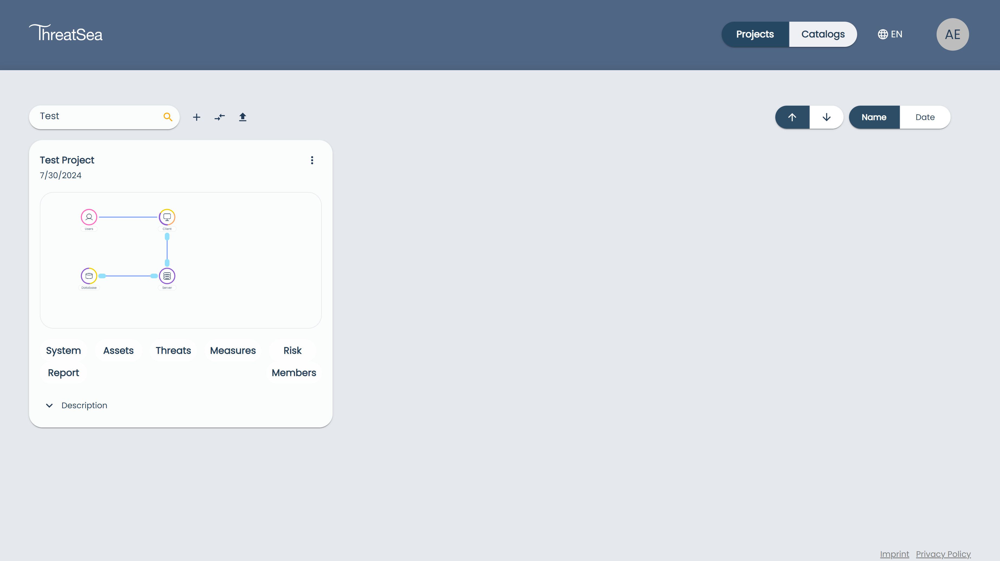

Each project is represented by a project tile with the project name, the project creation date, a preview of the system model, shortcuts to the specific views of the system and an expandable description of the project.

Project owners can use the dropdown menu in the top right corner of the project tile to edit, export or delete the project. For users that only have the viewer or editor role, the menu is not visible.

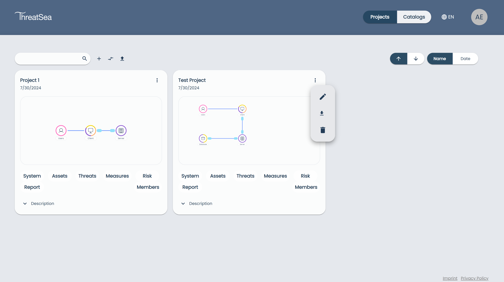

### Create project

Projects can be created by using the ‘+’ Button right to the search window. This button is only visible for privileged users. To create a project, a project name and optionally a description have to be provided and the 4x6 catalog that shall be used in the project has to be selected. Note that at least view permissions on the catalog that shall be used are required. Additionally the project owner can give a information classification (public, internal, confidential, highly confidential), which will be displayed in the header of each project, on each page of the pdf report and also in the name of generated Excel reports. Those informations can only be changed by the project owner.

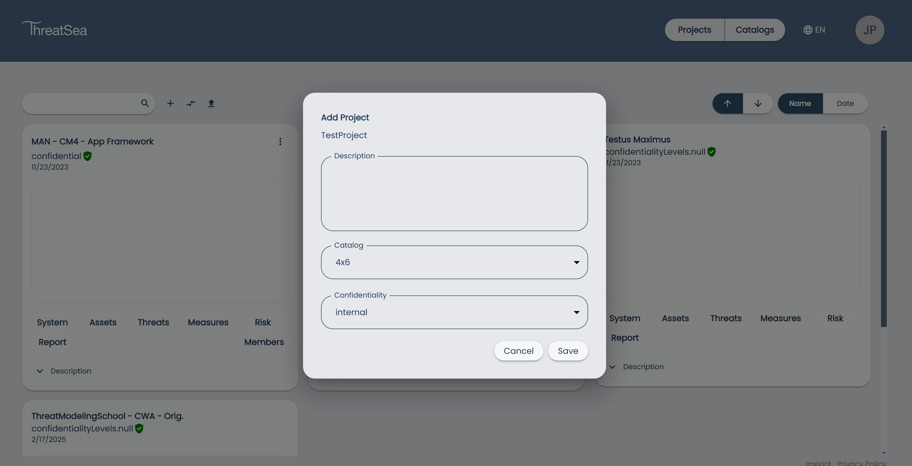

### Import project

Exported projects (JSON files) can be imported again into ThreatSea with the  button. Project members are not ex- and imported.

The "migrate project" button  is a temporary feature that serves for migrating projects to the new datamodel introduced by the new measure handling in Q4 2023. Its functionality is described here: New Measure handling - Migrate Projects. It will be removed again after a grace period.

### Edit project

The project owner can change the name, description, the used catalog and the information classification via the dropdown menu in the top right of the project tile. Currently, the latter is not recommended to be used, we recommend choosing one single catalogue for the whole lifetime of a project. Future releases will improve this functionality.

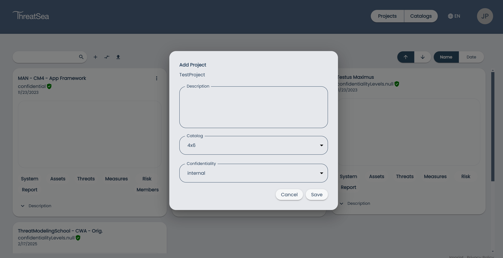

### Export project

The project owner can export the project as downloadable JSON file via the dropdown menu in the top right of the project tile. Project members are not ex- and imported.

### Delete project

The project owner can delete the project and all its contents via the dropdown menu in the top right of the project tile. After confirming the safety dialog, this action is irreversible!

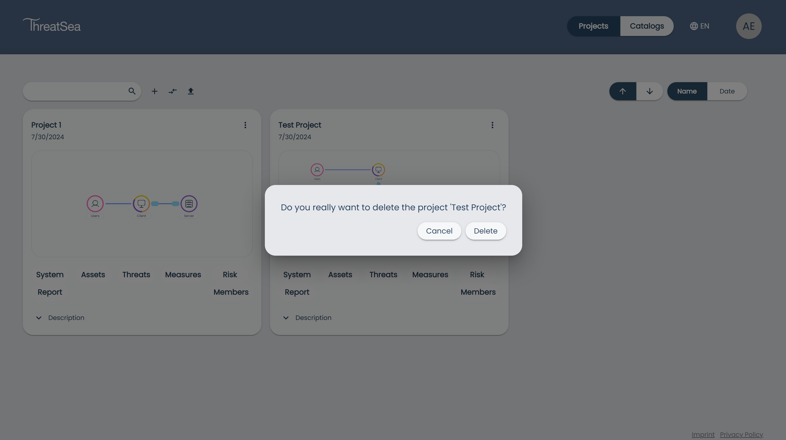

## Projects

Projects have seven main views, all of them accessible via the header bar:

- System – Graphical editor to model the system architecture in terms of the 4x6 model
- Assets – List of assets and their protection needs
- Threats – List of threats, their descriptions and probabilities of occurrence
- Measures – List of measures, their descriptions and implementation dates
- Risk – Risk matrix representation of the threats and their assigned measures
- Report – Settings for report documents to be generated
- Members – Project user authorizations

The views can also be accessed via the shortcuts in the single project tiles from the projects view.

## System editor

The system editor is used to draw graphical representations of technical systems by decomposing these systems into single components and the connections between them.

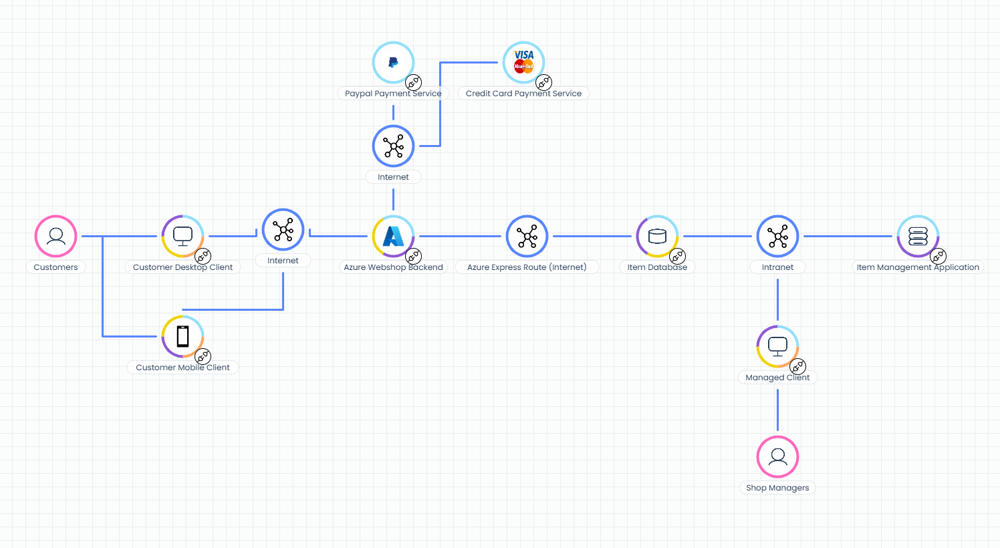

By holding the primary mouse key and moving the cursor, users can navigate through the system sketch. The top-left "focus" button  allows quick navigation by centering and scaling the editor view relatively to the overall system sketch. With the "download" button  the system sketch can be downloaded as png file.

In the system editor, a system is represented by a set of components. A component is an arbitrary unit of a system that is a combination of one or more of the six attack points. The scope of components differs individually for each project depending on the depth of the threat analysis. For large enterprise scale threat models, a component within the system sketch might (technically) be a system on its own like a server, a client or a database, while in other projects, single applications or even processes might be modeled as dedicated components. Due to its high abstraction of technical details, the methodology works for all scopes.

### Creating a component

A component can be created by clicking with the secondary mouse button into any unoccupied space of the system editor and choosing the type of component from the menu appearing at the location of the click. Users can either select from one of the four pre-defined component types or from custom component types.

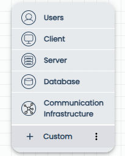

After selecting a component type, a pre-filled component of that type appears at the location of the initial mouse-click. The color coding of the component border indicates the attack points the component comprises:

- Yellow: Data Storage Infrastructure
- Purple: Processing Infrastructure
- Orange: User Interface
- Pink: User Behaviour

The remaining two attack points are displayed in the following color-coding in the system editor:

- Light Blue: Communication Interface
- Blue: Communication Infrastructure

### Default component types

ThreatSea provides four default component types that represent very typical infrastructure components, that are also restricted to a subset of attack points:

- User: A component representing a human user. It consists only of a "user behaviour" attack point, no other attack points can be enabled.
- Client: A component representing a client device. It can consist of the attack points data storage infrastructure, a processing infrastructure and a user interface which are all activated by default. The attack point "user behaviour" is disabled for this component.
- Server: A component representing a server or any backend component. It can consist of the attack points data storage infrastructure, a processing infrastructure and a user interface of which only the first two are activated by default. The attack point "user behaviour" is disabled for this component.
- Database: A component representing a data storage component. It can consist of the attack points data storage infrastructure, a processing infrastructure and a user interface of which only the first two are activated by default. The attack point "user behaviour" is disabled for this component.
- Communication infrastructure: Communication infrastructures represent infrastructures for data exchange between two or more parties, like for example the internet, but also a local WiFi network. These components do not have any other attack point than Communication Infrastructure. They can used to connect several other components using communication interface attack points.

### Moving a component

Users can move components within the system editor by drag and drop. The editor displays an alignment grid during this operation.

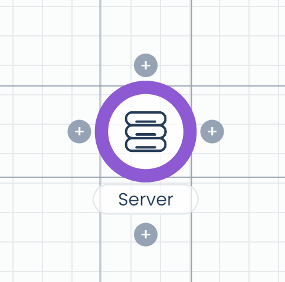

### Editing a component

By clicking on a component, users can open the "edit component" pop-up pane. There, in the top row, the user can edit the name of the component and delete the component with the  button.

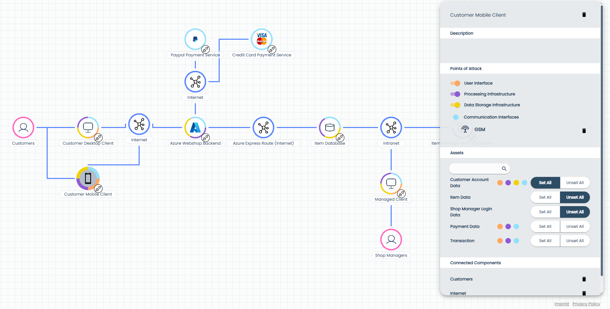

#### Assigning attack points

In the second part of the dialog, users can select which of the four non-communication related attack points the component comprises. As an example, a mobile client most typically consists of a data storage infrastructure (i.e. the phone storage), a processing infrastructure (i.e. the phone processor) and a user interface (i.e. the touchscreen UI). If a component should be displayed graphically within the system sketch but not generate any threats (_out of scope_), the user can deactivate all attack points with the toggle switches to achieve this behaviour.

Tipp:

- Although components out of scope do not affect the threat generation, they leverage the completeness and intuitiveness of the system sketch.

This does not hold true for Communication interfaces however, as they behave differently. A component can have an arbirtrary number of communication interfaces. They are listed in the component pane, where their name can be edited and where they can be deleted again. Consequently they cannot be "deactivated" like the other attack points.

Since attack points are relevant for the creation of threats, their deletion could lead to loss of work (e.g refinement of threats) as the threats related to the attack point will disappear. Therefore the deactivation or deletion of attack points in the system editor requires user confirmation.

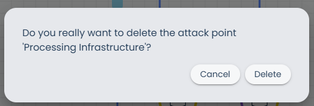

#### Assigning assets

The third part of the dialog displays a color-coded overview of the asset assignments to the single attack points. In the example below, the purple dot indicates that the asset "Customer account data" is processed by the selected component ("Customer mobile client"), more concretely, that the asset is assigned to the "Processing Infrastructure" attack point of the selected component. The logic for communication interfaces is a little bit different: Here, a full light-blue dot means that the asset "Customer account data" is received via **all** communication interfaces of the component (GSM, WiFi), where a half light-blue dot (like for the asset "payment data") means that the asset is assigned to at least one but not all of the communication interfaces of the component.

With the "Set All" and "Unset All" buttons, users have a quick possibility to assign or unassign a single asset to or from **all** attack points which the selected component comprises.

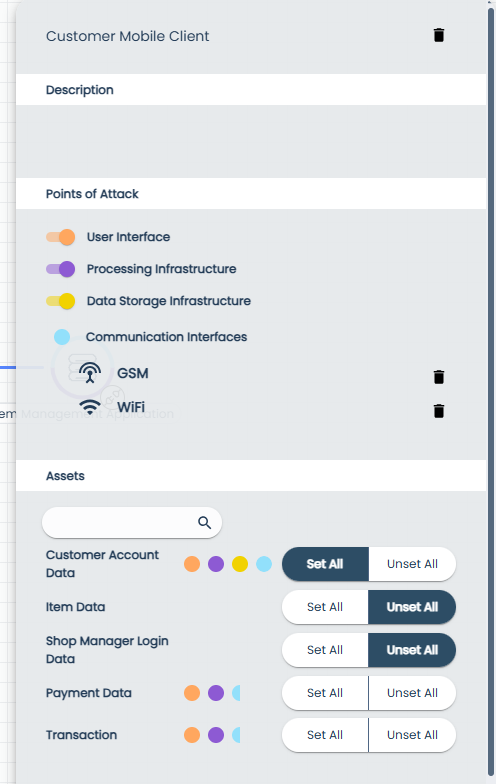

### Custom component types

Besides the four generic component types "Users", "Client", "Server" and "Database", users can also create custom component types individually for each project. The list of custom component types that exist within the project is displayed after clicking on "Custom" when creating a new component.

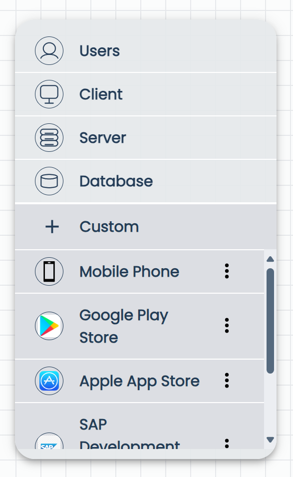

Custom component types have to be created once and afterwards can be used within the project in which they have been created. A new custom component type can be created by clicking on the + Button when creating a new component.

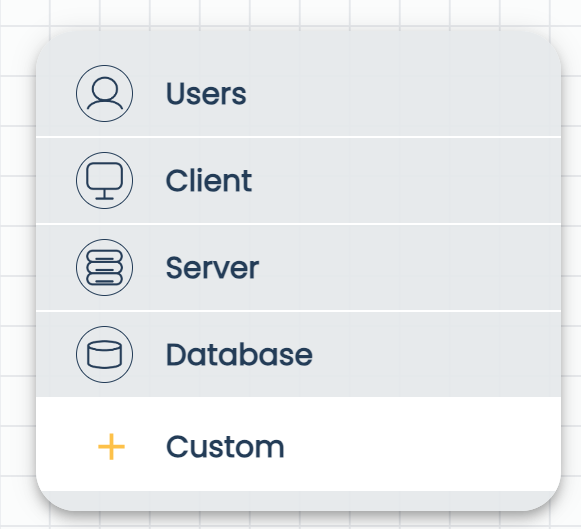

Users have to provide the following information for the component type:

- Name: Name of the custom component type
- Icon (optional): Icon that should be displayed within the system sketch for each component of the component type. Only files with MIME-type image/\* and a size less than 100kB can be used.
- Attack Points: With the attack point toggles, users can specify, which attack points (out of the four non-communication related attack points) should be activated by default for each component of the component type

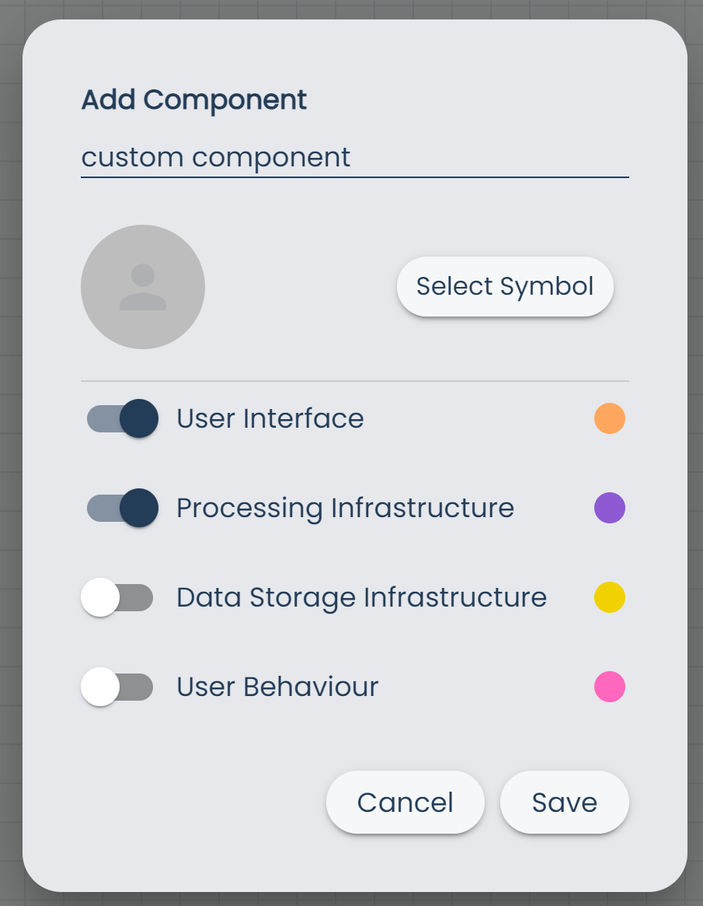

After initial creation, the custom component type appears in the list of custom component types and can be used to create new components.

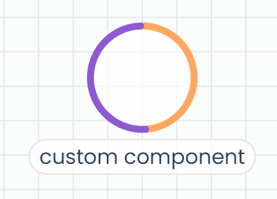

### Assigning assets to specific attack points of components

Besides the "Set All"/"Unset All" buttons in the "Edit component" dialog, users can assign assets to a specific attack point of a component. This can be achieved by clicking on the respective color-coded part of the border of the component. In the example below, clicking on the yellow part of the border opens the dialog that allows the user to assign assets specifically to the attack point "Data Storage Infrastructure" of the component "Client" with the toggle switches.

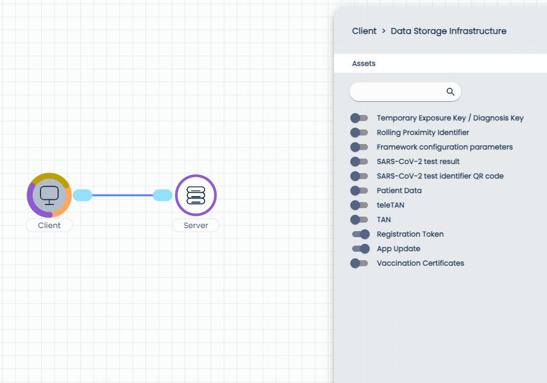

For communication interfaces, as there can be more than one of them, clicking on the light-blue border of the component opens a context menu, in which the user can select the specific interface they want to assign assets to:

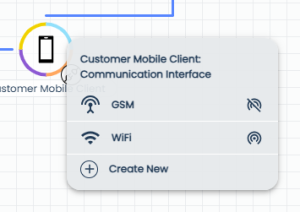

Clicking on one of the entries leads to the same dialog as shown before, where the user can assign assets to the communication interface.

### Communication infrastructure and communication interfaces

Users can connect components to visualize a communication relationship between them by using the attack point types "Communication Interface" and "Communication Infrastructure", visualized in the following color-coding:

- Light Blue: Communication Interface
- Blue: Communication Infrastructure

#### Creating a communication interface

Users can create a communication interfaces at a component by clicking on the buttons that are displayed in the button right corner of a component and selecting "Create New" in the list of communication interfaces. They can give a name and select an icon for the new communication interface.

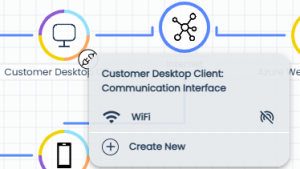

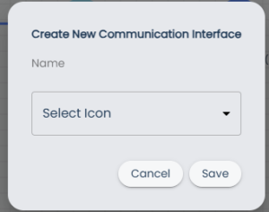

#### Editing communication interfaces and assigning assets

Communication interface can either be edited or deleted via the previously shown "edit component" dialog or users can select the light blue border of the component, then select the desired communication interface and then edit/delete the interface or assign assets to the interface.

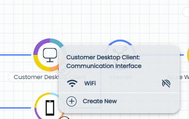

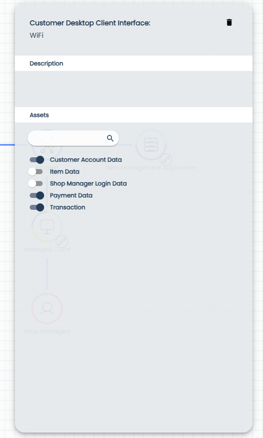

#### Connecting communication interfaces to communication infrastructures

Users can connect communication interfaces to communication infrastructures to visualize networks. This can be achieved by opening the list of interfaces via the  button or the light blue component border and then selecting the  icon.

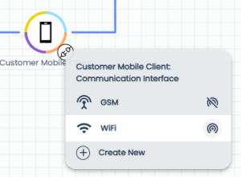

The mouse pointer then drags a blue line from the selected component. The user then can assign the target of the communication flow by clicking on one of the + buttons of the target component (of type Communication Infrastructure). The creation of a communication flow can be aborted by clicking into an empty space in the editor grid.

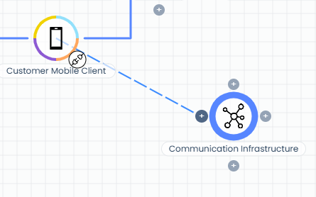

When completing the communication relationship, ThreatSea creates a visual connection between the component and the communication infrastructure.

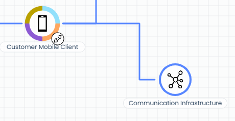

With the  button, users can remove an existing connection from a single communication interface.

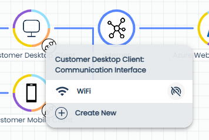

#### Editing communication infrastructures

When clicking on a communication infrastructure, users can edit the name of the infrastructure and assign assets to this attack point by using the "Set All"/"Unset All" buttons. With the top-right  button the user can delete the communication infrastructure. This action does not affect the communication interfaces linked to that communication infrastructure, only the visual connection is deleted. In the "Connected Components" part, the user can remove connections to other components via the single  buttons.

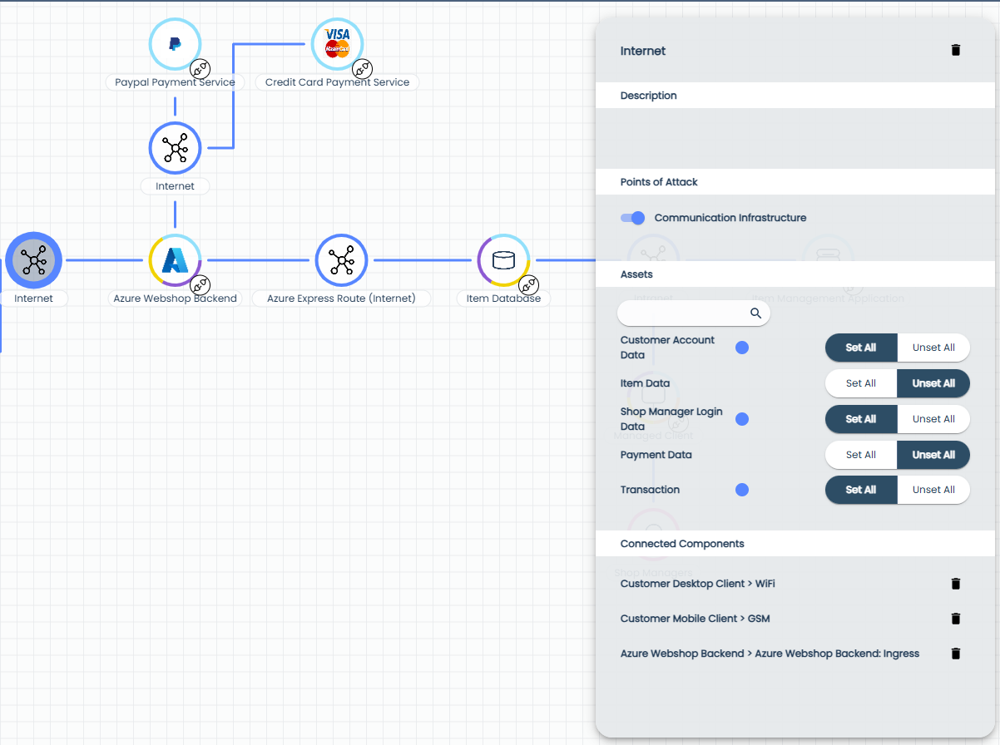

Tipp:

- Users can also individually name connections by clicking on the connection itself. This allows giving more context information in the system model, e.g. protocol or directional information.

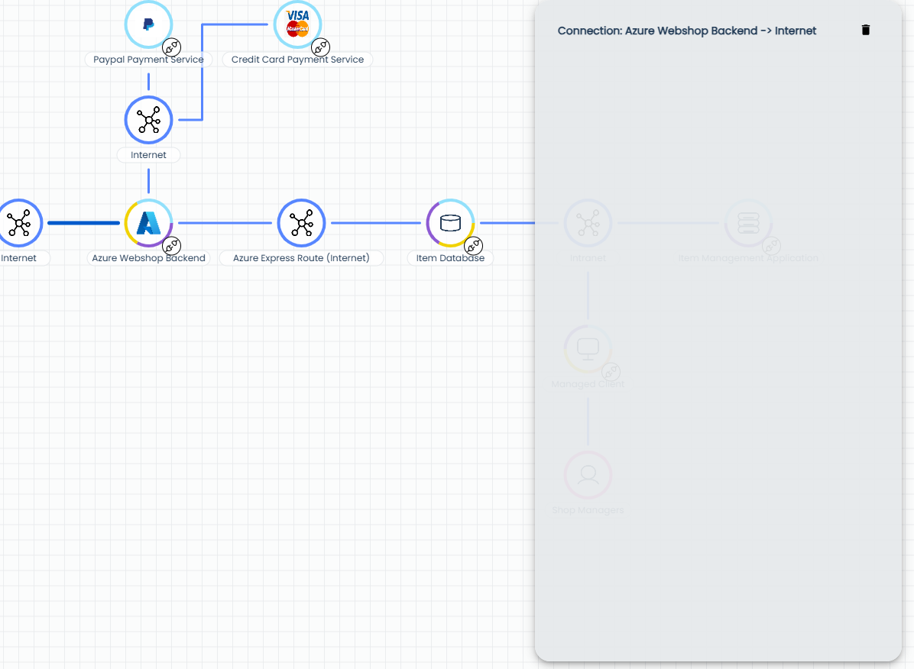

### User components

Components of type "user" cannot be assigned with other attack points than "User behaviour" as they represent a concrete user group. Similarly to communication connections, user can be connected to other components to indicate that the specific user group uses this component. This assignment is only a graphical illustration within the editor and has no effect on the threat generation.

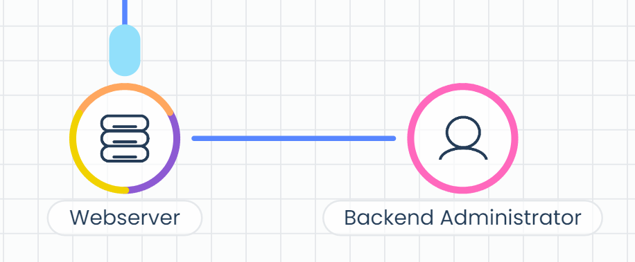

## Assets

The assets view visualizes the results of the protection need analysis for the system. It contains a list of all assets, their individual protection needs for the three protection goals **confidentiality**, **integrity** and **availability**, as well as their creation date.

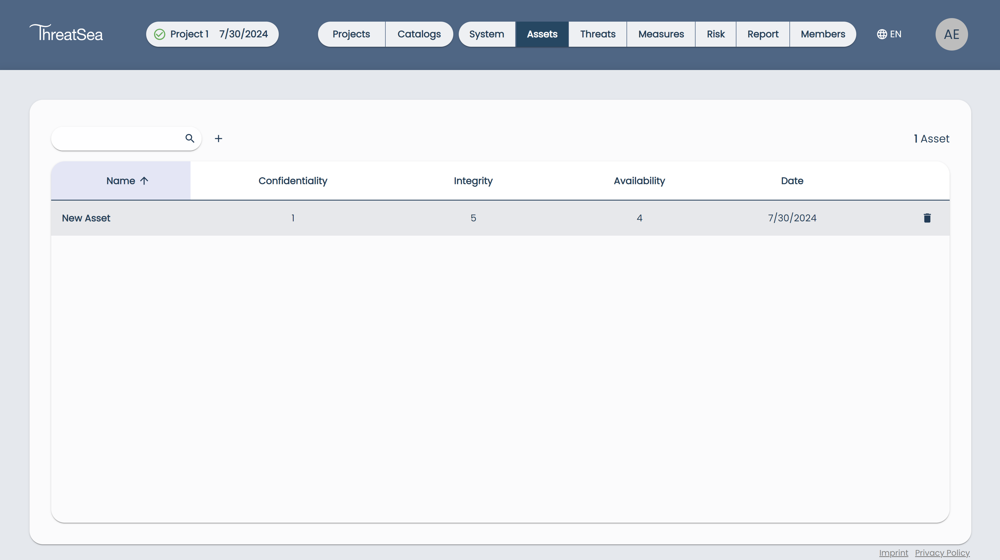

Users can sort the assets in ascending and descending order according to their name, the protection need for each protection goal and their creation date. They can also search for specific assets by using the search bar. The search covers the asset name and the description.

### Creating an asset

Users can create new assets by clicking on the + button.

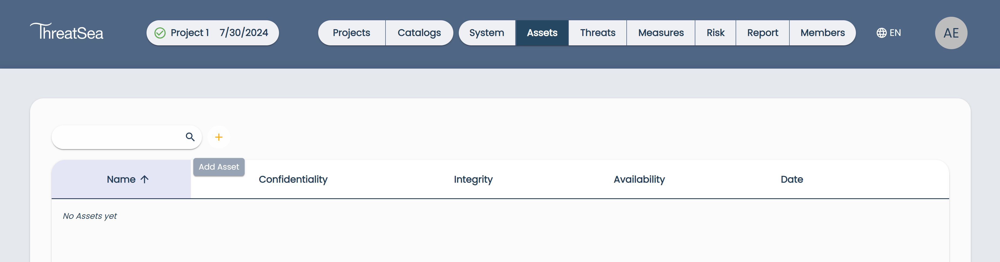

In the following dialog, users can give a name, a description and protection need values in a range from 1 to 5 according to the 4x6 impact scale for the asset.

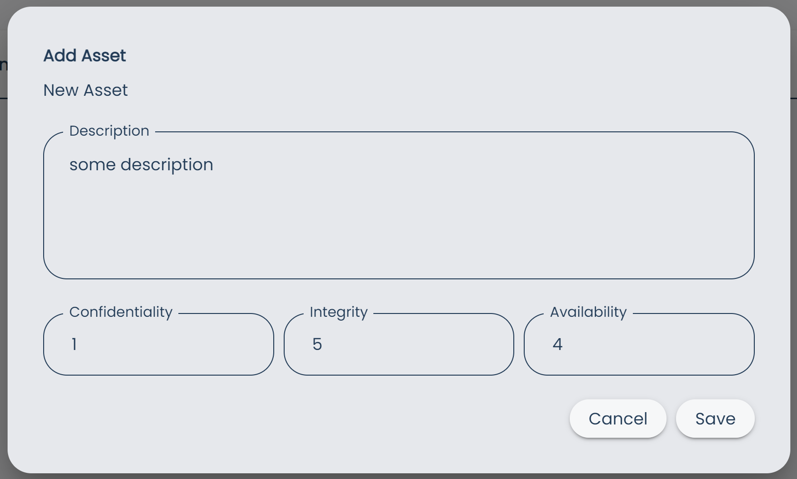

Tipp:

- It is highly recommended to give extensive descriptions of the assets as well as justifications for the choice of the impact ratings in the description field. This allows a better understanding of the system and traceability of the decisions that have been made during the protection need analysis.

### Editing an asset

Clicking on an asset entry opens the same dialog as when creating an asset that allows the user to (re-)edit all values.

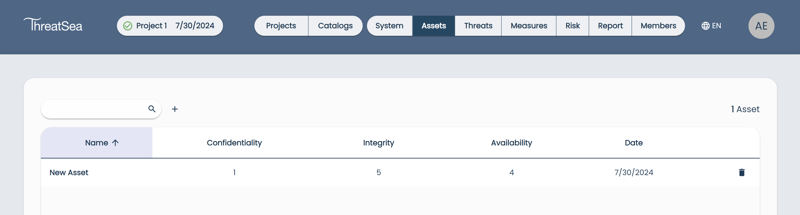

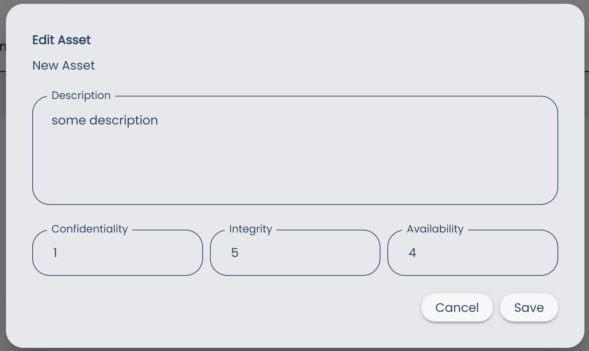

### Deleting an asset

Users can delete an asset via the  button in the respective row of the asset. A safety dialog has to be confirmed.

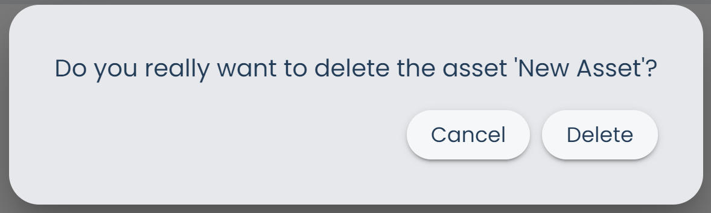

## Threats

The threats view is one of the core features of ThreatSea and displays the user a list of all threats that are relevant for the system containing the following information:

- **Name:** Name of the threat
- **Assets:** Number of assets that are affected by the threat scenario
- **Component:** Name of the component that is affected by the threat scenario
- **Point of Attack:** Type of the attack point in the component that is affected by the threat scenario, as used in the 4x6 methodology (data storage infrastructure, processing infrastructure, user interface, user behaviour, communication interface, communication infrastructure)
- **Attacker:** Type of attacker that is involved in the threat scenario, as used in the 4x6 methodology (unauthorized parties, system users, application users, administrators)
- **Probability:** (Gross) probability value for the risk that is associated with the threat scenario
- **Damage:** (Gross) impact value for the risk that is associated with the threat scenario
- **Risk:** (Gross) risk value that is associated with the threat scenario
  Users can sort the threats list according to each of these information in ascending or descending order or search for specific threats. The search covers the name of the threat, its description, the component, the point of attack and the attacker.

Known Issue:

- Currently, the search uses the English names of the attackers and points of attack, irrespectively of the shown language.

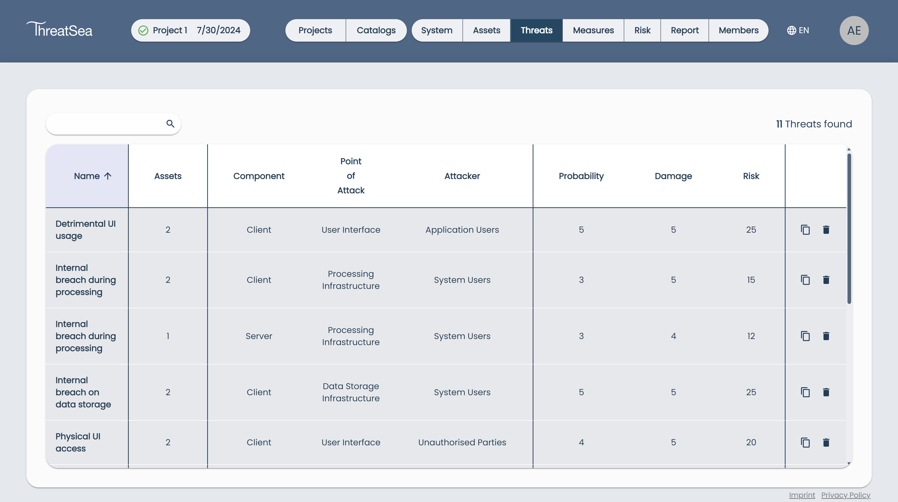

ThreatSea auto-generates the threat list by applying the threat catalogue that is assigned to the project. Each time the system sketch or the asset analysis is changed, the threat list is updated accordingly. To support users in keeping track of the refined threats, they can mark threats as "edited" after refining them. All threats that are marked as "edited" are displayed in grey in the threat list.

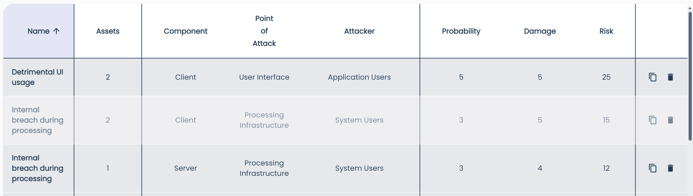

Tipp:

- When refining the threats, it is highly recommended to develop an individual way of going through the threats in some kind of systematic order.
- When hovering over the number of assets for a threat, a popup is displayed with the names of the assets and their protection need values for confidentiality, integrity and availability.

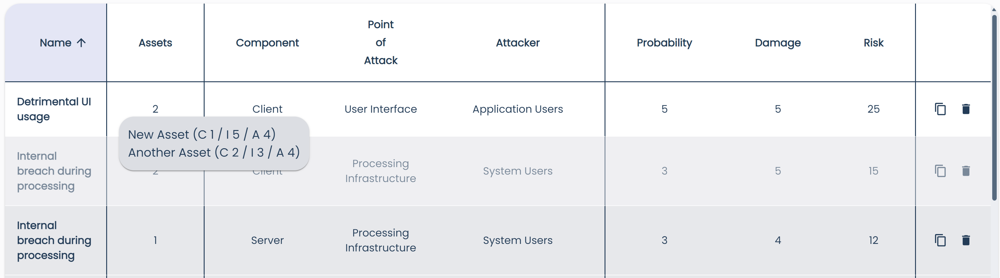

### Editing a threat

Users can edit a threat scenario by clicking on the respective entry in the threats list which opens the "Edit Threat" dialog.

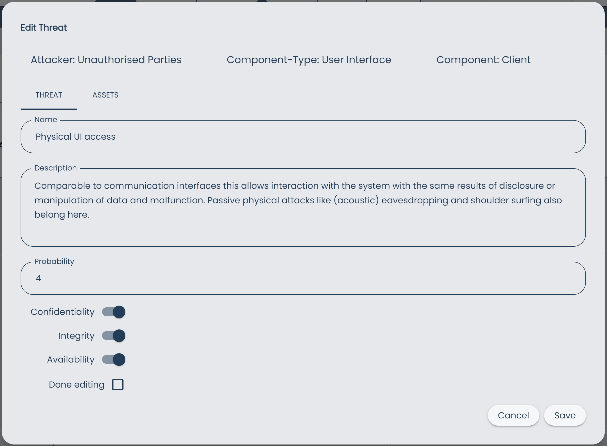

The top row of this dialog contains the base information of the threat:

- **Attacker:** Type of attacker that is involved in the threat scenario, as used in the 4x6 methodology (unauthorized parties, system users, application users, administrators)
- **Component-Type:** Type of attack point in the component that is affected by the threat scenario, as used in the 4x6 methodology (data storage infrastructure, processing infrastructure, user interface, user behaviour, communication interface, communication infrastructure)
- **Component:** Name of the component that is affected by the threat scenario

The main part of the dialog is the "THREAT" tab, where the user can refine the threat during the threat assessment (i.e., refine the generated 4x6 threat scenario to a concrete threat scenario instance that could occur in the system under consideration). The values for "Name", "Description" and "Probability" are filled with the values defined in the catalogue used in the project. When refining a threat, the user can give custom text values for the threat scenario name and description and fill the probability value for the associated risk in a range from 1 to 5 according to the 4x6 probability scale.

Tipp:

- It is highly recommended to give extensive descriptions of the real-world instantiations of the threats as well as justifications for the choice of the probability ratings in the description field. This allows other users to get a better understanding of the system and the decisions that have been made during the threat analysis. The default descriptions can be kept in addition to clarify the origin of the refined threat scenarios. It might also be helpful to already note measures as comments during this step if they come up during the discussion.
- With the toggle switches for the three protection goals confidentiality, integrity and availability, users are able to exclude protection need values of the affected assets from the risk calculation for the specific threat scenario. E.g., if a threat only threatens the confidentiality of the associated assets, the user can disable integrity and availability for the risk calculation. A very common, real-world example for this is unauthorized parties destroying some piece of equipment. This ruins availability but doesn't affect confidentiality at all.

Tipp:

- Disabling the toggle switches for all three protection goals results in a risk value of 0 (due to no impact) but still keeps a threat scenario in the threat list. This can be used to set single threats out of scope.
- After refining a threat scenario, users can check the "Done editing" checkbox to indicate that the threat has already been processed. As described earlies, threat scenarios that have been marked as edited are displayed in light grey in the overall threat list.
- The "ASSETS" tab within the edit threat dialog is an additional informative tab that quickly allows the user to see an overview of the assets that are impacted by the threat scenario, including their protection need values.

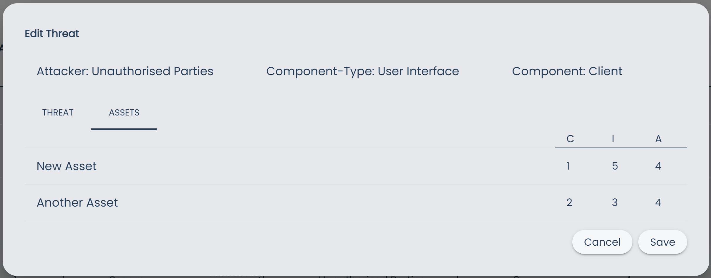

### Duplicating a threat

In some cases it is necessary to duplicate a threat. This usually happens when there are different threat scenarios which greatly differ in their probability for the different protection goals. In most cases it is sufficient to focus on the worst-case scenario but sometimes it might be necessary to explicitly highlight this difference in the threat list and to duplicate the threat scenario. E.g., given above example about destroying equipment, there might also be other physical attacks from unauthorized parties which actually pose a risk to confidentiality but are more difficult to execute than simply swinging a hammer at the equipment and therefore have a lesser probability of occurrence.

Users can duplicate a threat scenario by using the  button in the row of the respective threat scenario. After confirming a safety dialog, the threat is duplicated with all values including the description copied, but the name being augmented with an incremented number in parenthesis, starting with 1 for the first copy.

### Deleting a threat

Users can delete a threat scenario by using the  button in the row of the respective threat scenario. After confirming the safety dialog, **this action cannot be reverted and the threat scenario can only be regenerated by recreating the component containing the attack point the threat originally was referring to.**

## Measures

The measures view lists all security measures that are planned or already implemented to reduce the risks related to the system and contains the following information:

- Name: Name of the security measure
- Scheduled at: (Planned) implementation date of the security measure

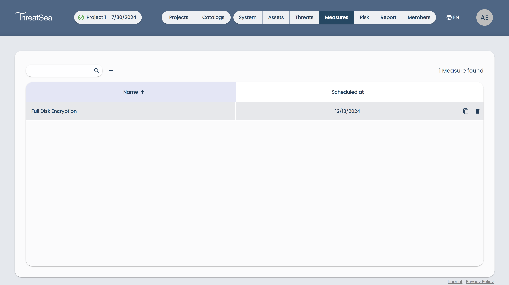

Users can sort the list of measures according to each of these information in ascending or descending order or search for specific measures. The search takes names and description fields into account.

Tipp:

- Use major release dates to assign measures to implementation cycles or phases.

### Creating a measure

Users can create new measures by clicking on the + button.

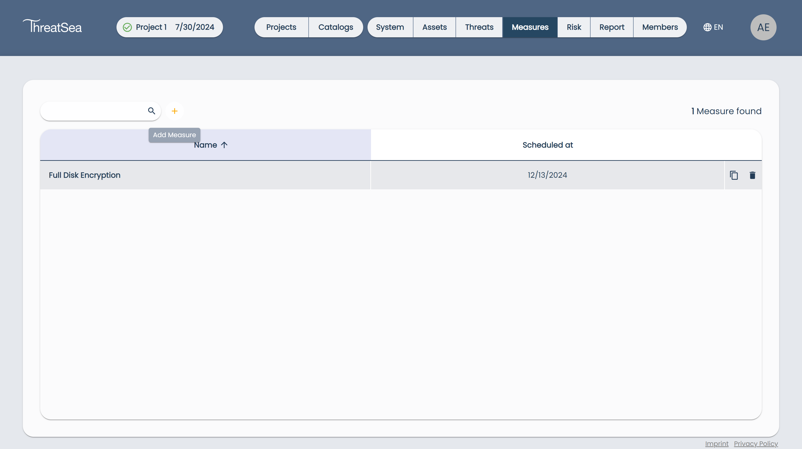

In the following dialog, users can give a name, a description and the (planned) implementation date for the measure. Dates can either by typed in the German format DD.MM.YYYY or chosen from the date picker shown after clicking on the calendar symbol to the right of the date field.

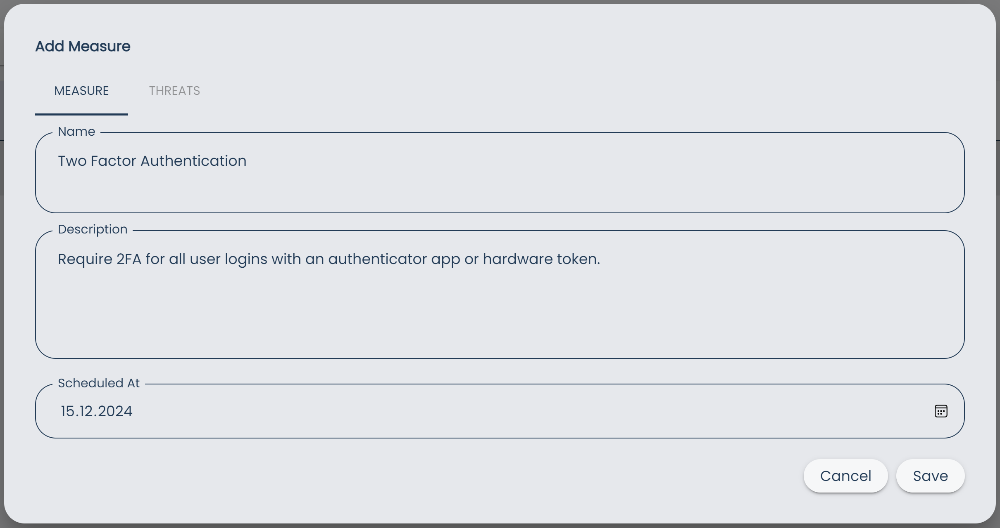

### Editing a measure

Users can edit a measure by clicking on the respective entry in the measure list which opens the "Edit Measure" dialog. The "Edit Measure" dialog provides two tabs, one for editing the base data and the other one for applying the measure to threat scenarios.

#### Editing measure base data

In the "MEASURE" tab of the "Edit Threat" dialog, users can edit the name, the description and the (planned) implementation date of the selected measure. Dates can either by typed in the German format DD.MM.YYYY or chosen from the date picker shown after clicking on the calendar symbol to the right of the date field.

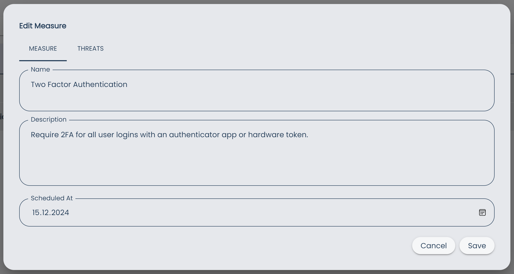

#### Applying a measure to threats

The "THREATS" tab of the "Edit Measure" dialog displays the user a list of all threat scenarios which are impacted (i.e., mitigated) by the measure. For each impacted threat scenario it contains the following information:

- **Threat:** Name of the affected threat scenario
- **Component:** Name of the component which is involved in the threat scenario
- **net Probability:** Probability value of the risk after the measure has been applied. All other measures are not considered in this calculation. If the measure does not impact the probability of the risk, this field contains the value "no Impact"
- **net Damage:** Damage value of the risk after the measure has been applied. All other measures are not considered in this calculation. If the measure does not impact the damage of the risk, this field contains the value "no Impact"

Users can sort the list of measures according to each of these information in ascending or descending order or search for specific threats that are already impacted by the measure. The search covers the names and the descriptions of the threats.

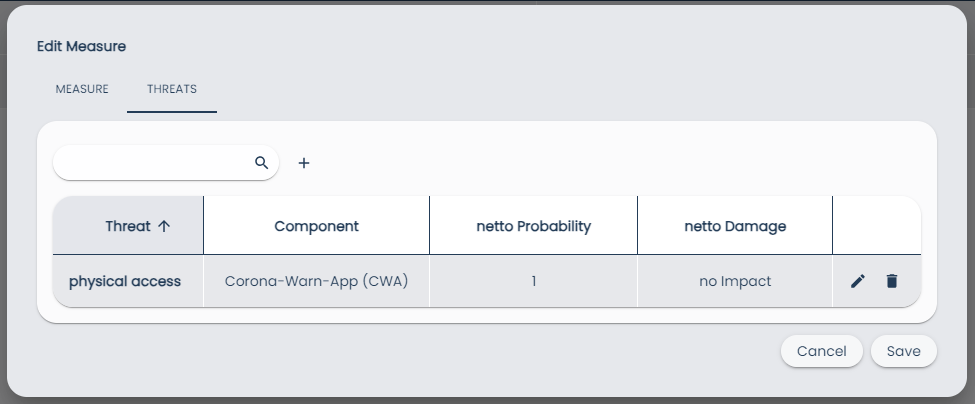

With the + button, users can apply the measure to other threat scenarios.

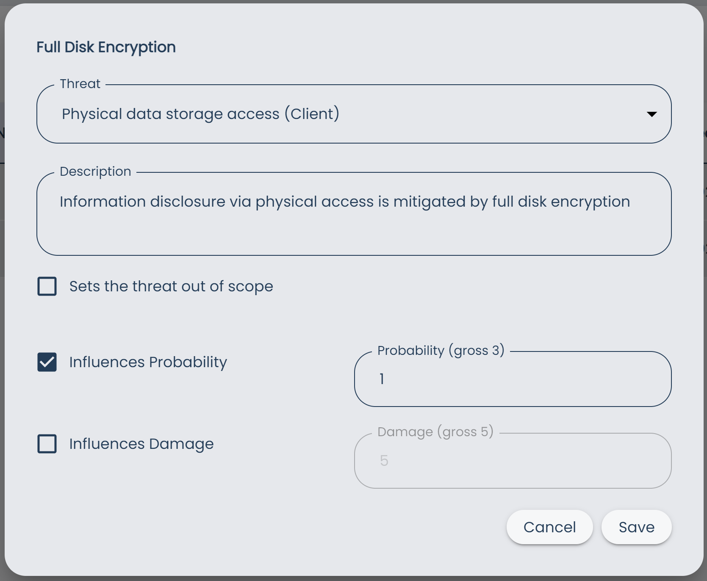

In the "Threat" dropdown, the user can select the threat scenario to which the measure shall be applied. If the measure has already been applied to a threat before, threats with the same attack point type / attacker type combination appear at the top of the dropdown list as "Suggested Threats".

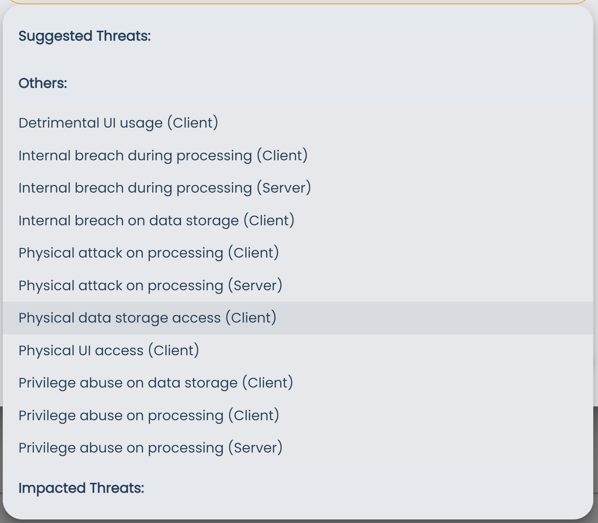

It doesn't make sense to apply a measure to a threat twice, so ThreatSea doesn't allow this. To make this transparent, the threats the measure has already been applied to are listed at the end of the drop-down as greyed out.

After selecting the threat scenario to which the measure shall be applied, the user may give a detailed description of how the measure impacts the threat. Users can select if the measure influences probability and/or damage values of the threat scenario by ticking the respective checkboxes. Typically, measures only influence probability values which is why only "Influences Probability" is selected by default. The user then can give net probability and/or damage values in a range from 1 to 5 according to the 4x6 scales. Both input fields for these values show the current gross probability and damage values of the risk greyed out and in the label. The actual value or values have always to be entered, even if there is no change, i.e. the measure has not enough impact to change the rating on the 4x6 scale at least one step.

The input fields don't take into account other measures applied but always show the gross values. As of now, ThreatSea does neither take the timeline into account nor take note of interdependencies between measures. Those things can be documented in the "Description" field but have to be incorporated into the risk values manually.

As of now, ThreatSea doesn't allow the increase of risk values. If an applied measure lowers probability or damage or sets the risk out of scope, later (in terms of the timeline) applied measures can't reintroduce the risk or increase the risk value. The gross values also can never be exceeded.

With the "Sets the threat out of scope", the user can indicate that after the measure has been applied, the threat is no longer in scope of the threat assessment. This feature can be used to indicate e.g. a risk transfer, i.e. if for example the risk ownership is transferred to a different party.

#### Editing the effect of a measure on a threat

Via the  buttons in the threat list shown in the "THREATS" tab of the "Edit Measure" dialog, users can edit the impact that a measure has on a specific threat. The displayed dialog afterwards is the same as for a applying a measure to threats but the selected threat is locked.

#### Editing a threat

When clicking on the name of a threat in the threat list shown in the "THREATS" tab of the "Edit Measure" dialog, the respective "Edit Threat" dialog is opened, where the user can view and edit the respective threat.

#### Deleting the effect of a measure on a threat

Users can delete the effect of a measure on a threat scenario with the  buttons in the threat list shown in the "THREATS" tab of the "Edit Measure" dialog. A safety dialog is shown before actually deleting the entry.

Known Issue:

- After closing any dialog created from the "THREATS" tab, ThreatSea jumps back to the "MEASURE" tab.

### Duplicating a measure

Users can copy a measure by using the button in the row of the respective threat scenario. This operation opens the "Add Measure" dialog with the respective fields prefilled with the description of the original measure and its name, prefixed with the words "Copy of". Neither the scheduled date nor the threat assignments are copied. If the user doesn't confirm this dialog with "Save", no action is taken.

### Deleting a measure

Users can delete measures with the  buttons in the measure list and have to confirm the safety dialog.

## Risk

The risk view provides the user with the full risk profile of the system, including all threats from the threats view, all measures from the measures view and the change of the risk profile over time. For each different (planned) implementation date of a new measure, a new point in the timeline within the risk view is created. Users can switch between the different points in time and see the effects of the newly implemented measures visualized in the risk matrix on the left side.

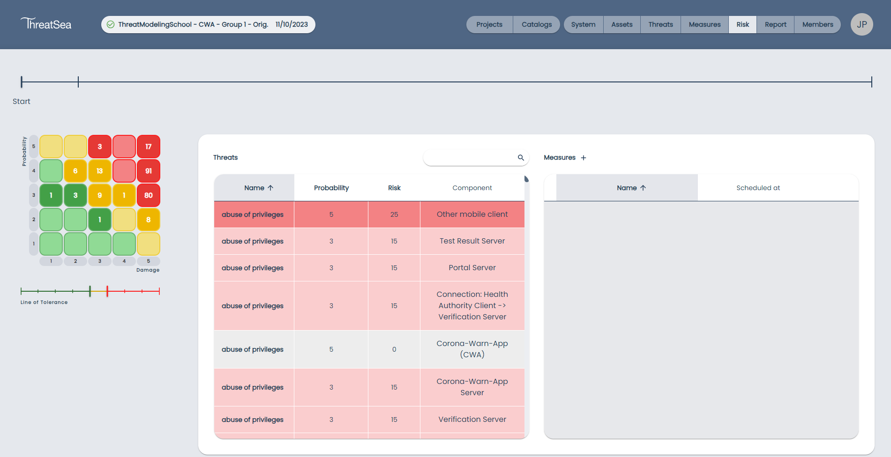

The risks are color-coded in the three risk categories **Low**, **Medium** and **High**. Users can adapt this color-coding with the "Line of Tolerance" bar below the risk matrix, where they can move the boundaries of the range of low and high risks.

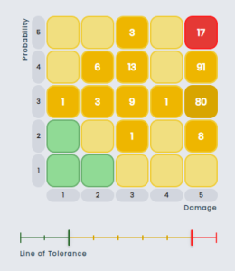

The risk matrix shows the absolute number of risks in a 5x5 matrix based on the 4x6 scales. While by default all threats are displayed in the "Threats" scroll panel in the middle of the screen, users can use the risk matrix to filter the threat list for all threats with risks of a specific probability/impact combination. For example, by clicking in the panel at position probability 3 and impact 3, the threat list is filtered for all threats with an occurrence probability of 3 and impact 3. Since the risk matrix is generated to reflect the selected point within the timeline, the filter does so too, meaning if a specific date is selected on the timeline and the user filters for a specific field of the risk matrix, the net probability and net impact values at this point within the timeline are used for the filter calculation. Clicking on an already selected field of the matrix resets the filter to show all risks.

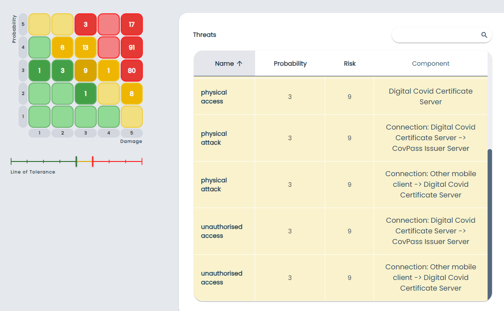

Within the "Threats" scroll panel, all threats matching the selected filter (or unfiltered) are displayed with the following information:

- **Name:** Name of the threat scenario
- **Probability:** Net probability value of the risk at the current selected point in the timeline
- **Risk:** Overall net value of the risk at the current selected point in the timeline
- **Component:** Name of the component involved in the threat scenario

Users can sort the list of threats according to each of these information in ascending or descending order or search for specific threats. The search covers the name of the threat, its description, the component, the point of attack and the attacker.

The user can select an entry in the list of threats to display the measures that have an impact on this specific risk in the right scroll panel. Independently of the selected point within the timeline, all measures assigned to the risk will appear, the selected point in the timeline only influences the filtering and color-coding. Note that if the user has a risk selected in a filtered list and then changes the point within the timeline, the risk might drop out of the filter, if the time selection changes the net risk of the risk. In the "Measures" scroll panel, the user can sort all measures applied to risk according to their name and their (planned) implementation date in ascending or descending order.

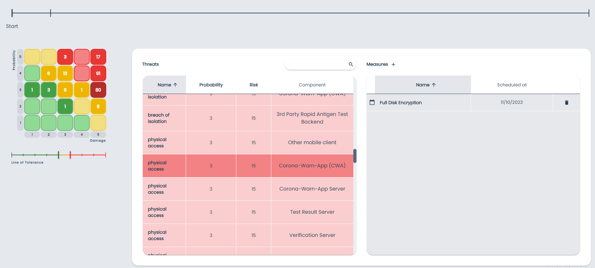

By clicking on the threat name the user can also quickly access the threat details with the "Edit Threat" dialog.

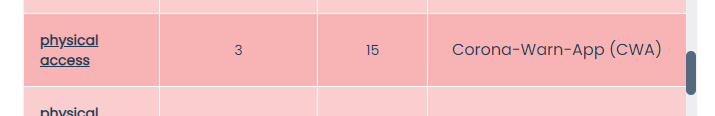

### Applying a measure to a risk

When a risk is selected, users can apply a measure to the risk with the + button above the "Measures" scroll panel.

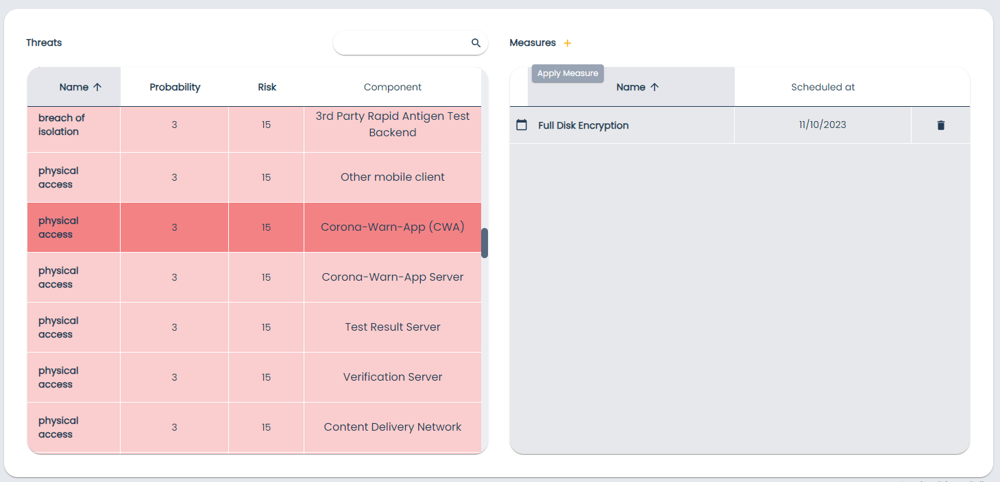

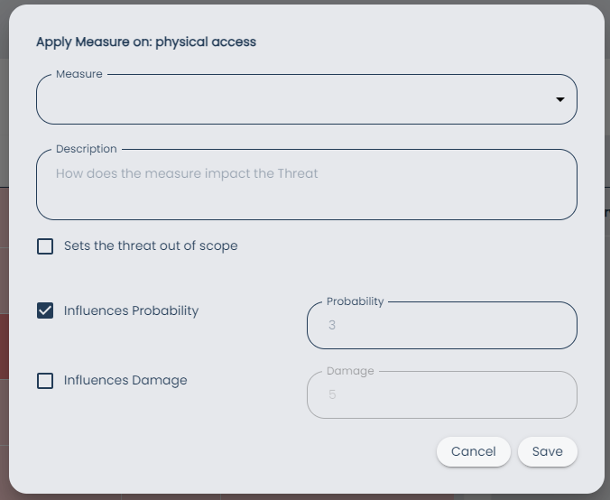

In the "Measure" dropdown, the user can select a measure that shall be applied to the threat.

The dropdown is structured in the following order:

- **Create Measure:** With the create measure button, the user can choose to create a completely new custom measure. When the user clicks on this button, the "Add Measure" dialog opens, where the user needs to give a name, a description and a (planned) implementation date for the measure. Afterwards the user flow returns to the "Apply Measure" dialog, where the newly created measure is pre-selected.

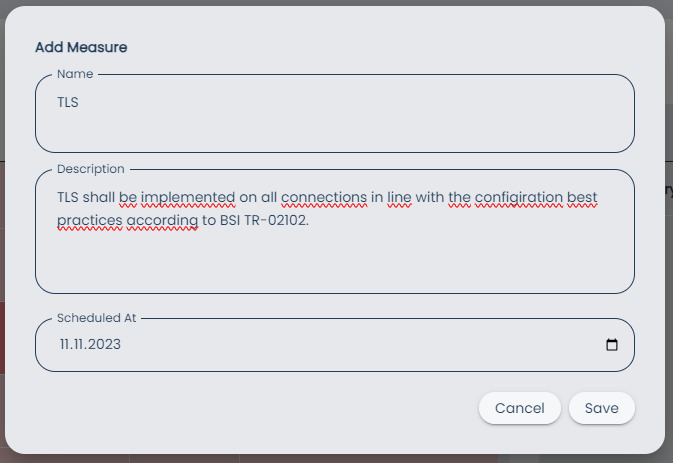

- **Suggested Measures:** Other measures that have already been applied to the same attack point type / attacker type combination or that were generated from catalogue measures that are applicable for the same attack point type / attacker type combination are suggested first.
- **Catalog Measures:** For each generic threat scenario, the catalog used in the project also contains generic measures which are proposed to the user at this point for the selected threat scenario. As these measures are not yet instantiated, selecting one of them also leads to the "Add Measure" dialog as explained above in "Create Measure" with a pre-filled name.
- **Others:** All other measures that have already been created within the system.

It doesn't make sense to apply a measure to a threat twice, so ThreatSea doesn't allow this. To make this transparent, the measures already applied are listed at the end of the drop-down as greyed out.

After selecting the measure to apply, the user may give a detailed description how the measure impacts the threat. Users can select if the measure influences probability and/or damage values of the threat scenario by ticking the respective checkboxes. Typically measures only influence probability values which only "Influences Probability" is selected by default. The user then can give net probability and/or damage values in a range from 1 to 5 according to the 4x6 scales. Both input fields for these values show the current gross probability and damage values of the risk greyed out and in the label. The actual value or values have always to be entered, even if there is no change, i.e. the measure has not enough impact to change the rating on the 4x6 scale at least one step.

With the "Sets the threat out of scope", the user can indicate that after the measure has been applied, the threat is no longer in scope of the threat assessment. This feature can be used to indicate a risk transfer, if for example the risk ownership is transferred to a different party.

### Unapplying a measure from a risk

When a risk is selected, users can unapply a measure from a risk with the  in the row of the respective measure assignment. This does not delete the measure from the "Measures" view but only removes the assignment from the risk.

## Report

In the report view, the user can generate PDF and excel reports for the risk and threat assessment and change the settings for these reports. With these settings, a report can be generated by clicking on "Create PDF Document". After the report has been generated successfully, it can be downloaded or displayed in the browser.

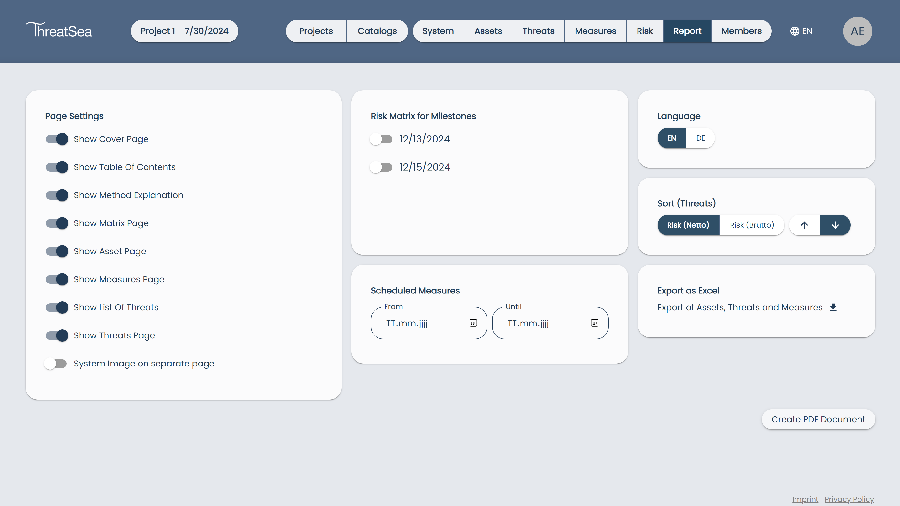

### Page Settings

The "Page Settings" panel provides the user with the possibility to select which of the following content should be included or excluded in the report via the respective toggle switches.

- **Show Cover Page:** A cover page with the name of the project and the creation date of the report
- **Show Table of Contents:** Table of contents for the report sections
- **Show Method Explanation:** A short explanation of the 4x6 methodology
- **Show Matrix Page:** At least gross and net risk matrices for the whole threat model. With the "Risk Matrix for Milestones" switches, matrices for the different points in the timeline can be added to this section
- **Show Asset Page:** A list of all analyzed assets together with their description and their protection need
- **Show Measures Page:** A list of all (planned) measures together with their descriptions, their (planned) implementation date and the threats to which they are applied
- **Show List of Threats:** A list overview of all threats and the component to which they apply, color-coded according to their gross or net risk value. This behaviour can be changed in the "Sort (Threats)" section. The list of threats also serves as a table of contents for the threat details.
- **Show Threats Page:** Details for all single threats, including the following information.
  - Name of threat
  - Protection goals that are impacted by the threat scenario
  - Component affected by the threat scenario
  - Attacker type involved in the threat scenario
  - Attack point type affected by the threat scenario
  - Assets impacted by the threat scenario
  - Measures implemented or planned to mitigate the risk associated to the threat scenario
  - Gross and net risk values together with probability and damage
  - Detailed description of the threat scenario
- **System Image on separate page:** The switch allows the user to create a dedicated page within the report for the system image. When deactivated, the system image is integrated into the cover page.

### Risk Matrices for Milestones

For each milestone in the measure timeline, the user can create a dedicated risk matrix as part of the "Matrix Page" within the report.

### Scheduled Measures

If the user would like the report to be restricted to a specific timeframe, they can give a timeframe for the measures that shall be considered for the report generation.

### Language

The user can generate the report in English or German language.

### Sort (Threats)

With the "Sort (Threats)" settings, the user can decide if the list of threats shall be sorted according to gross or net risk values in ascending or descending order.

### Export as Excel

With the  button, the user can download an excel export of the project including tabular representations of the assets, threats, measures and measure impacts (i.e., the impact relations between risks and measures) included in the threat model. The layout of this export cannot be changed by other settings.

## (Project) Members

In the members view, the user can change the access and role settings for the project. For each project member name, email address and the project role are displayed. The user can then sort all project members according to this data in ascending or descending order. The user can also search for a specific project member. With the tiles "Owner", "Editor" and "Viewer" in the top row, the user can filter for project members with the respective role.

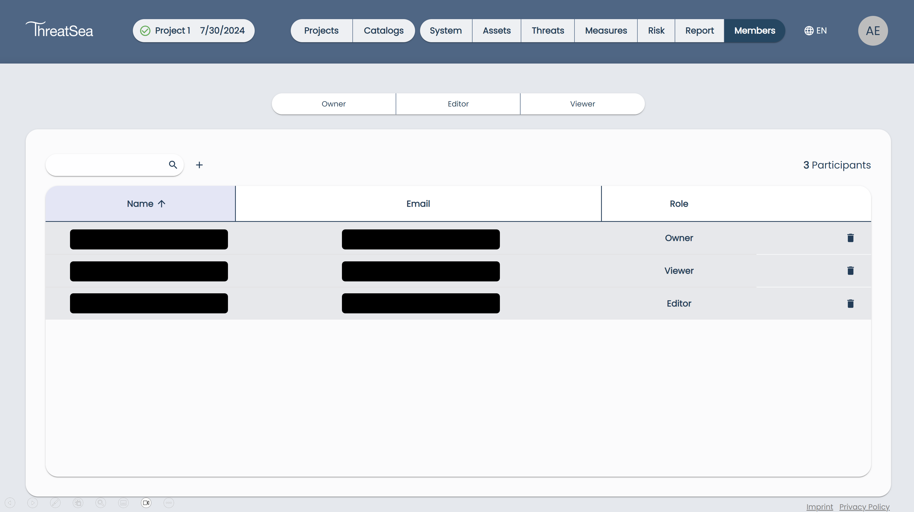

### Project roles

For each project, three different roles can be assigned to users.

- **Viewer:** Viewers have basic read access to projects. They cannot edit any details and also cannot export or delete projects. Additionally, the "Members" view is completely disabled for viewers.
- **Editor:** Editors have read and write access to all project details except the project members to which they only have read access. They cannot export or delete projects.
- **Owner:** Owners have full access to projects including project export and deletion. They are also allowed to add new members or edit member roles.

### Adding a member

Project owners can add members to their project with the + button.

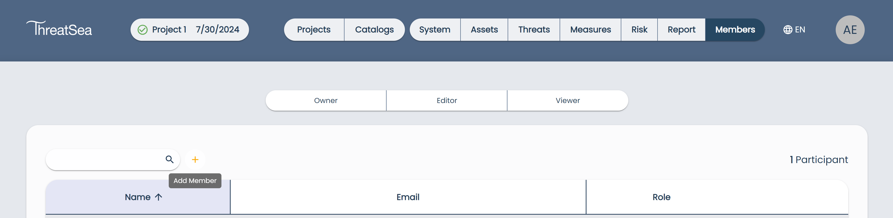

In the "Add Member" dialog they can either select a user from the list or search for a specific user. Note that **only users that already logged into ThreatSea before can be selected**. In the "Role" dropdown the role for the new project member can be selected.

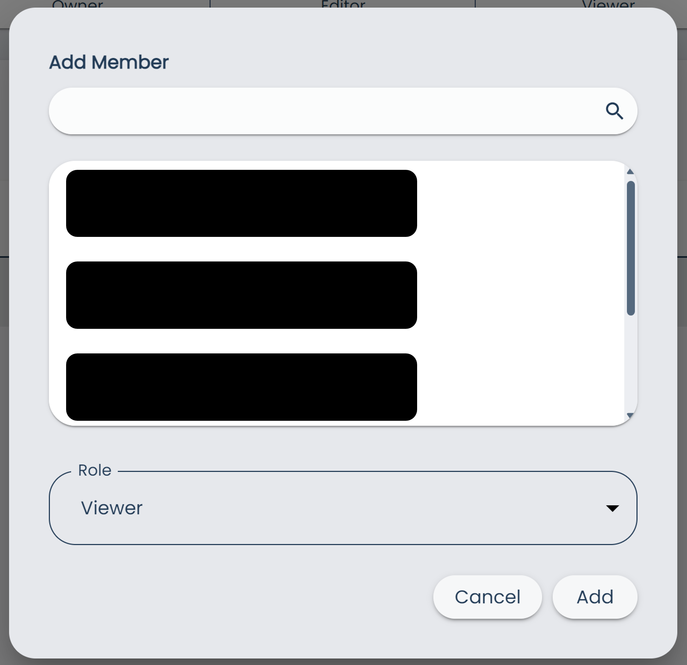

### Editing a member

Project owners can edit member assignments by clicking on the row with the respective member assignment. They can also edit their own project role to viewer or editor, if at least another owner for the project exists.

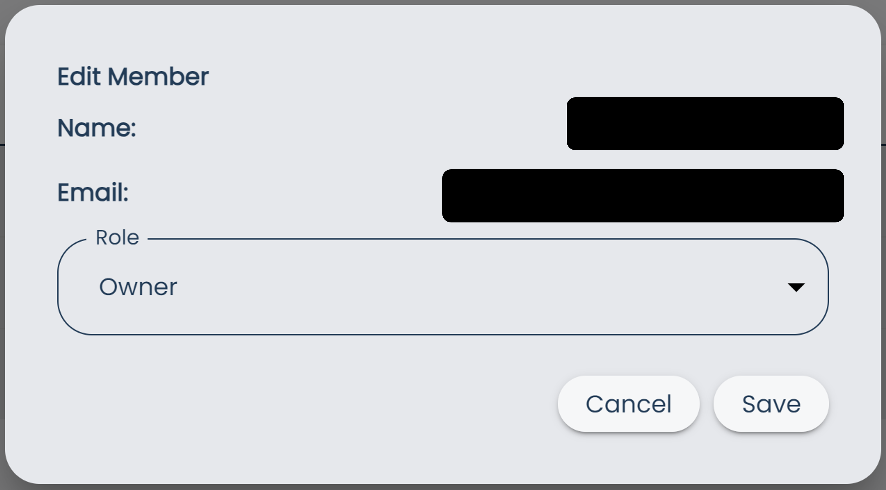

### Deleting a member

Project owners can remove project members with the  in the row of the respective member assignment.

## Catalogs view

After switching to the catalog view, a user can see an overview of all catalogs to which they have access to. They can sort these catalogs according to name or creation date in ascending or descending order or search for specific catalogs. For catalogs to which they have owner access, the  and  are shown. By clicking on a catalog entry, users can open the respective catalog.

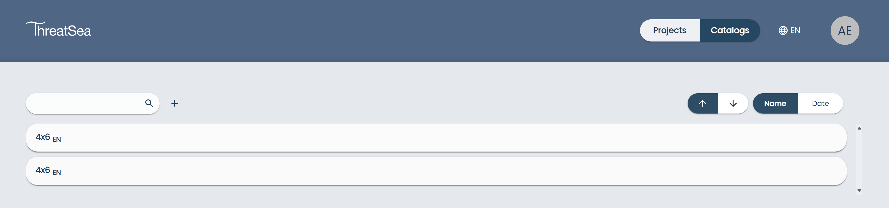

### Create catalog

With the + button right to the search pane, users can create new catalogs.

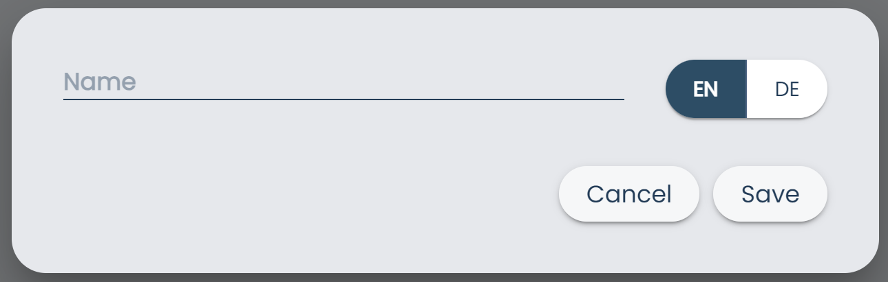

They need to provide a name for the catalog and to choose a language (English or German) for the catalog. By default, a new catalog is pre-filled with a generic 4x6 matrix (in the selected language) as used within the plain 4x6 methodology.

### Edit catalog

With the  button, catalog owners can edit the name of their catalogs.

### Delete catalog

With the  button, catalog owners can delete their catalogs.

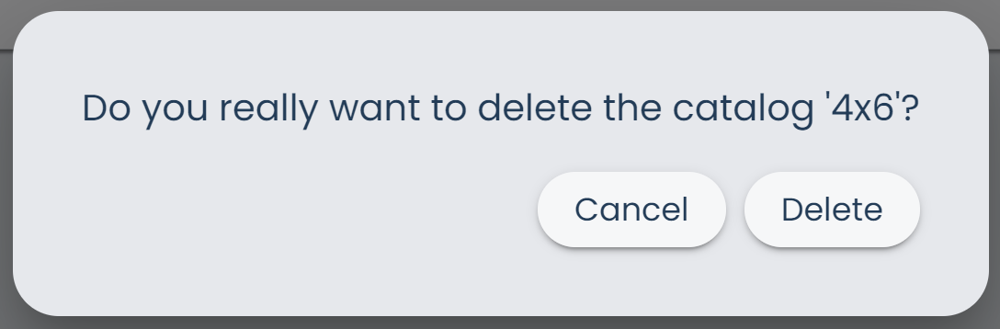

## Catalogs

Each catalog is a representation of a 4x6 matrix in ThreatSea and is used by projects to generate proposed threats ("catalog threats") and measures ("catalog measures") for specific attacker type / attack point type combinations. The main view for catalogs lists the catalog threats on the left side and the catalog measures on the right side. Users can sort both lists according to name or creation date in ascending or descending order and search for specific catalog threats or catalog measures. With the two rows in the top, users can filter for all catalog threats and measures that apply to a specific attacker type and/or a specific attack point type.

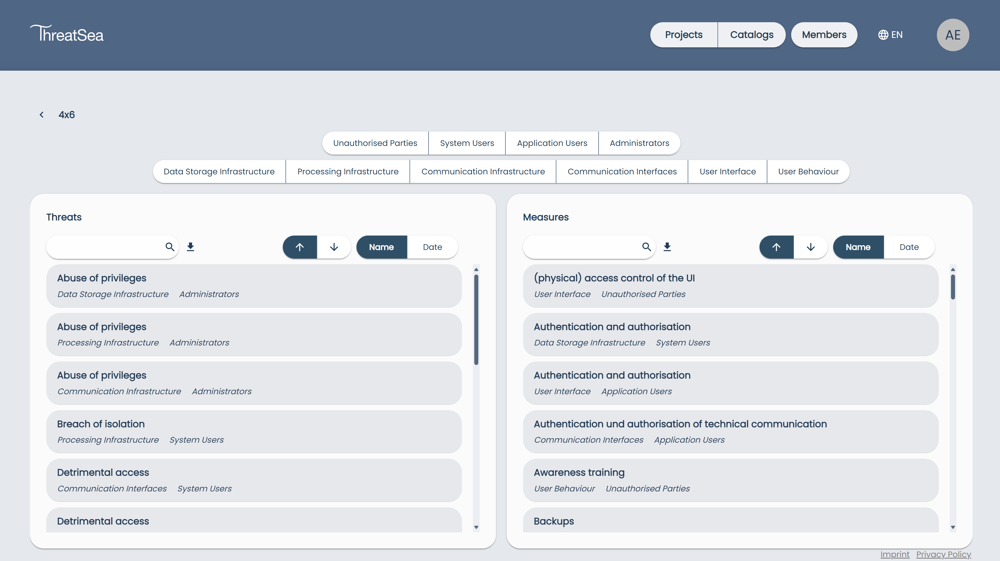

Editing catalog threats and measures will impact all projects that use these catalogs and should only be done by experts.

Known Issue:

- Currently, the import () and export () buttons have no functionality and will be disabled completely in a future update.

### Creating a catalog threat

Catalog editors and owners can add new catalog threats to the catalog with the + button.

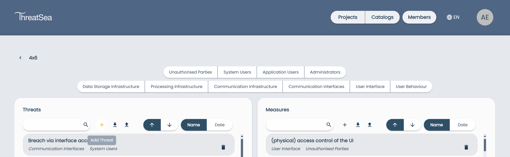

In the following "Add Threat" dialog, the user can give the following information for the catalog threat, which will be used as default information for the threat lists generated in all projects that use the specific catalog.

- **Name:** Name of the catalog threat
- **Description:** Description of the catalog threat
- **Attacker:** Attacker type(s) for which the catalog threat is applicable. More than one entry in the dropdown list can be selected. Note that selecting multiple attacker types will generate multiple catalog threats in the list, one for each selected attacker type.
- **Points of Attack:** Attack point type(s) for which the catalog threat is applicable. More than one entry in the dropdown list can be selected. Note that selecting multiple attack point types will generate multiple catalog threats in the list, one for each selected attack point type.
- **Probability:** Default (gross) probability value of the risk related to the threat.

With the toggle switches for **Confidentiality, Integrity** and **Availability** the user is able to indicate that the catalog threat only applies to specific protection goals. ThreatSea considers the protection goals for the impact calculation for risks in specific projects.

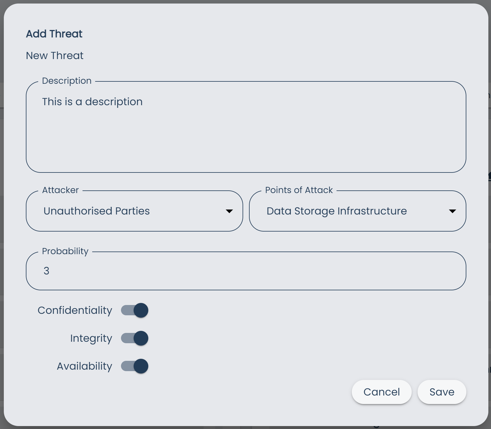

### Editing a catalog threat

Catalog editors and owners can edit catalog threats by clicking on the respective threat entry within the list.

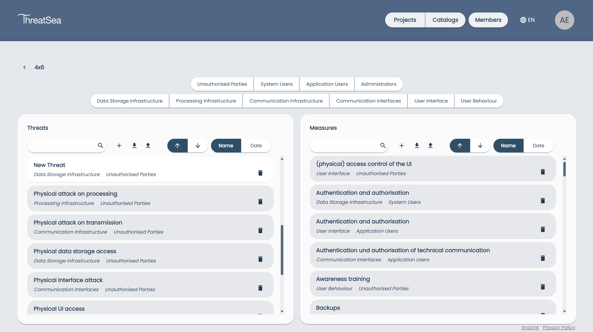

In the following "Edit Threat" dialog, the user can edit the following information for the catalog threat, which will be used as default information for the threat lists generated in all projects that use the specific catalog.

- **Name:** Name of the catalog threat
- **Description:** Description of the catalog threat
- **Attacker:** Attacker type(s) for which the catalog threat is applicable. In contrast to creating a catalog threat, only one option can be selected as the positioning of an already existing catalog threat within the 4x6 matrix is fixed.
- **Points of Attack:** Attack point type(s) for which the catalog threat is applicable. In contrast to creating a catalog threat, only one option can be selected as the positioning of an already existing catalog threat within the 4x6 matrix is fixed.
- **Probability:** Default (gross) probability value of the risk related to the threat.

With the toggle switches for **Confidentiality, Integrity** and **Availability** the user is able to indicate that the catalog threat only applies to specific protection goals. ThreatSea considers the protection goals for the impact calculation for risks in specific projects.

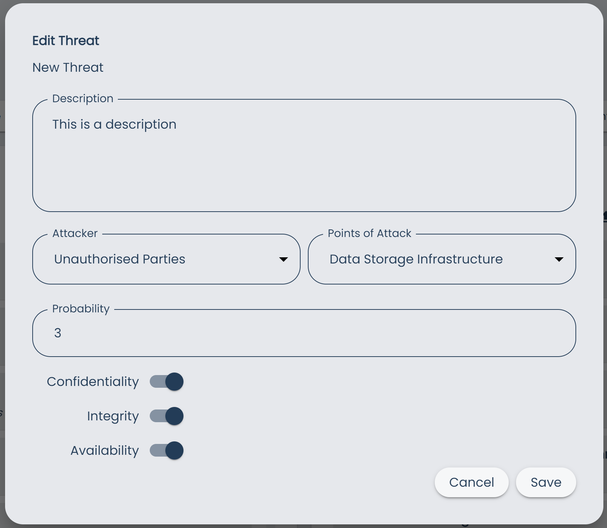

### Deleting a catalog threat

Catalog editors and owners can delete catalog threats by clicking on the  button for the corresponding threat entry within the list and subsequently confirming the deletion in a safety dialog.

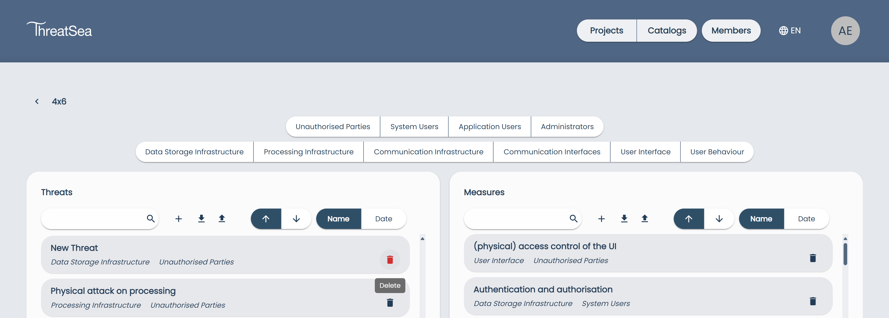

### Creating a catalog measure

Catalog editors and owners can add new catalog measures to the catalog with the + button.

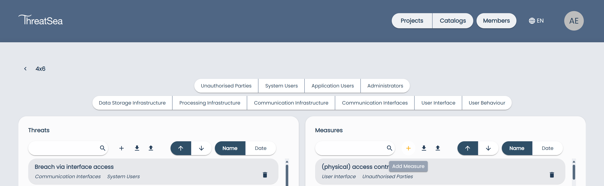

In the following "Add Measure" dialog, the user can give the following information for the catalog measure, which will proposed in all projects that use the catalog as measure for all threats at the same attacker type / attack point type combination as specified in the catalog measure.

- **Name:** Name of the catalog measure
- **Description:** Description of the catalog measure
- **Attacker:** Attacker type(s) for which the catalog measure is applicable. More than one entry in the dropdown list can be selected. Note that selecting multiple attacker types will generate multiple catalog measures in the list, one for each selected attacker type.
- **Points of Attack:** Attack point type(s) for which the catalog measure is applicable. More than one entry in the dropdown list can be selected. Note that selecting multiple attack point types will generate multiple catalog measures in the list, one for each selected attack point type.

Known Issue

- Currently, the "Probability" field in the "Add Measure" dialog and the Confidantiality, Integrity, Availability toggle switches have no effect and should not be used. In the future they might be removed completely

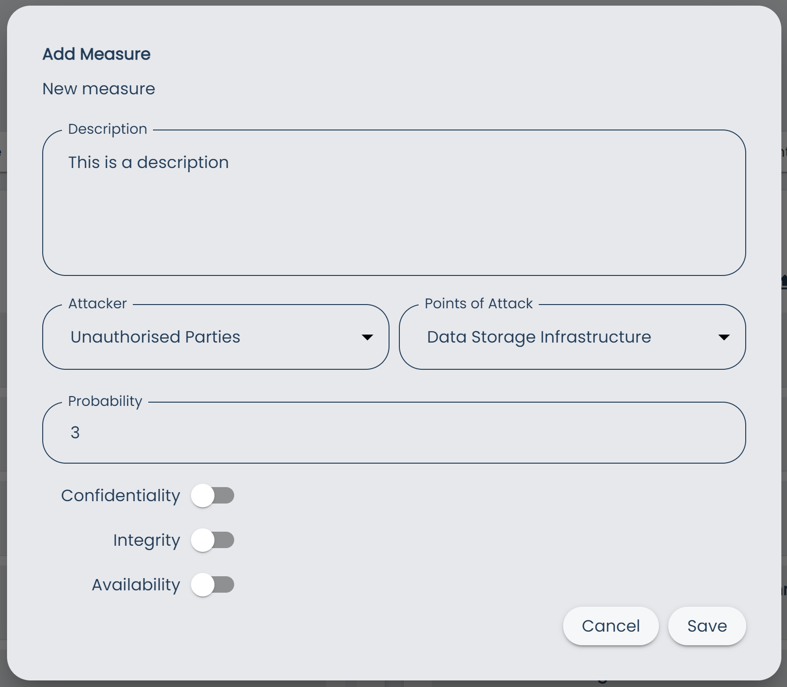

### Editing a catalog measure

Catalog editors and owners can edit catalog measures by clicking on the respective measure entry within the list.

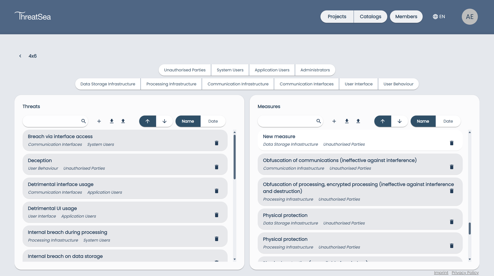

In the following "Edit Measure" dialog, the user can give the following information for the catalog measure, which will proposed in all projects that use the catalog as measure for all threats at the same attacker type / attack point type combination as specified in the catalog measure.

- **Name:** Name of the catalog measure
- **Description:** Description of the catalog measure
- **Attacker:** Attacker type(s) for which the catalog measure is applicable. More than one entry in the dropdown list can be selected. Note that selecting multiple attacker types will generate multiple catalog measures in the list, one for each selected attacker type.
- **Points of Attack:** Attack point type(s) for which the catalog measure is applicable. More than one entry in the dropdown list can be selected. Note that selecting multiple attack point types will generate multiple catalog measures in the list, one for each selected attack point type.

Known Issue

- Currently, the "Probability" field in the "Edit Measure" dialog and the Confidantiality, Integrity, Availability toggle switches have no effect and should not be used. In the future they might be removed completely.

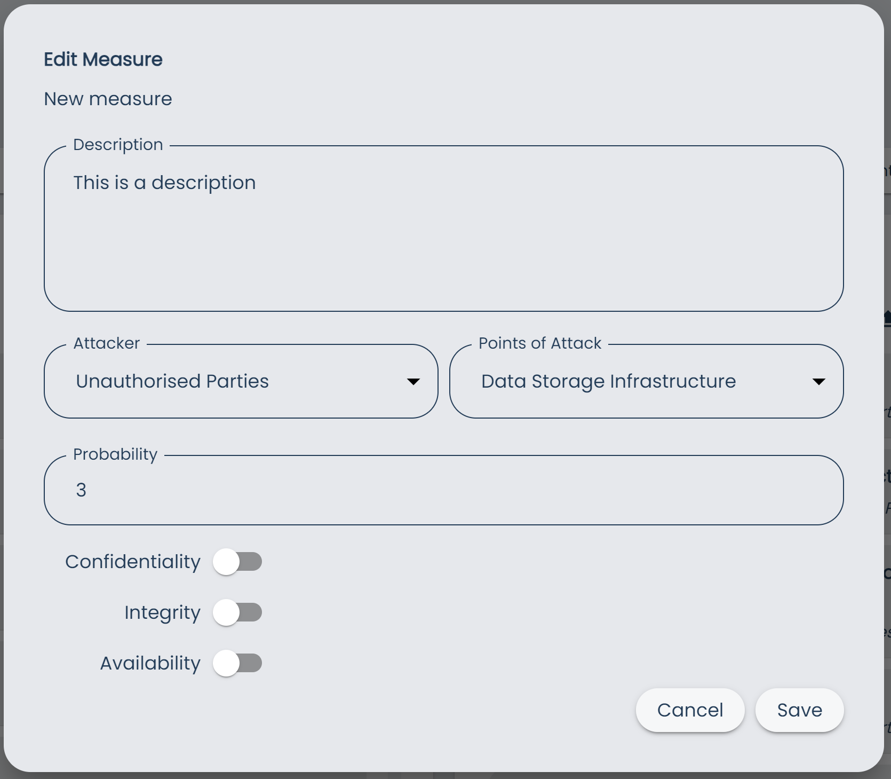

### Deleting a catalog measure

Catalog editors and owners can delete catalog measures by clicking on the  button for the corresponding measure entry within the list and subsequently confirming the deletion in a safety dialog.

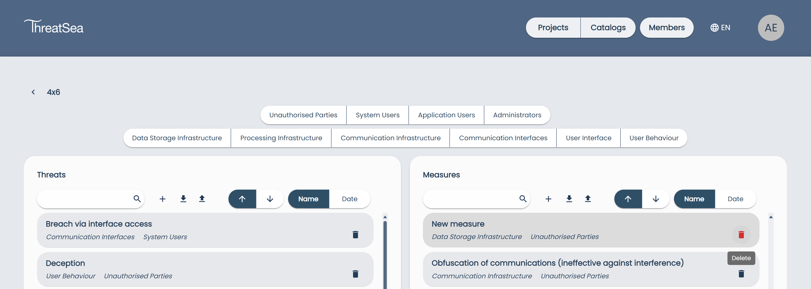

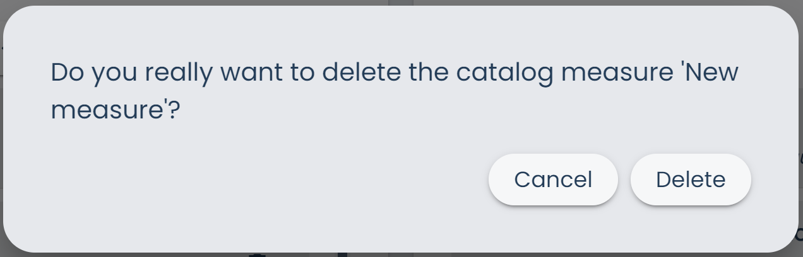

## (Catalog) Members

In the members view, the user can change the access and role settings for the catalog. For each catalog member name, email address and the catalog role are displayed. The user can then sort all catalog members according to this data in ascending or descending order. The user can also search for a specific catalog member. With the tiles "Owner", "Editor" and "Viewer" in the top row, the user can filter for catalog members with the respective role.

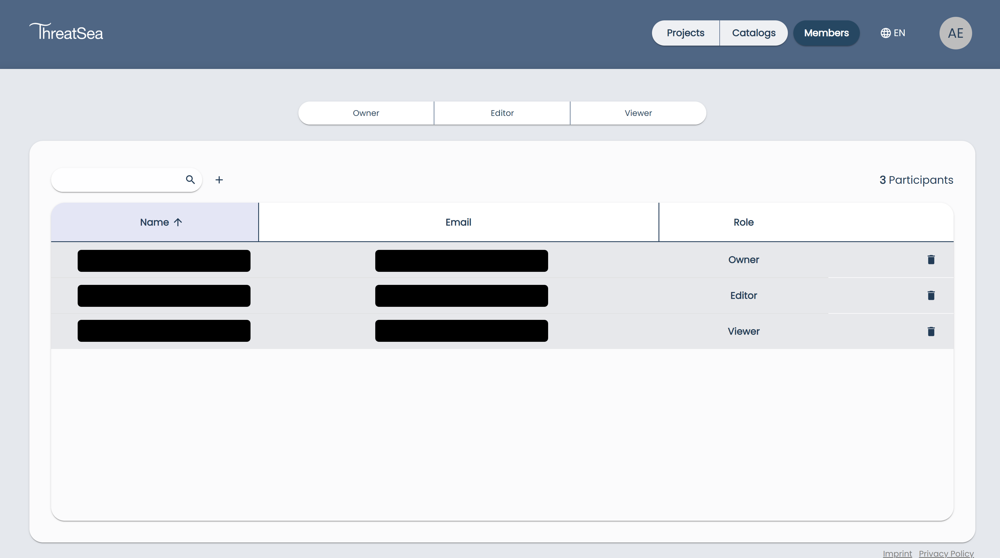

### Catalog Roles

For each catalog, three different roles can be assigned to users.

- **Viewer:** Viewers have basic read access to catalogs. Consequently they can use the catalog for their projects. They cannot edit details within the catalog.
- **Editor:** Editors have read and write access to all catalog details except the catalog members. They also cannot delete the catalog.
- **Owner:** Owners have full access to catalogs including catalog deletion. They are also allowed to add new members or edit member roles.

### Adding a member

Catalog owners can add catalog members to their project with the + button.

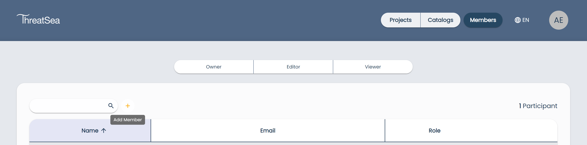

In the "Add Member" dialog they can either select a user from the list or search for a specific user. Note that only users that already logged into ThreatSea before can be selected. In the "Role" dropdown the role for the new catalog member can be selected.

### Editing a member

Catalog owners can edit member assignments by clicking on the row with the respective member assignment. They can also edit their own catalog role to viewer or editor, if at least another owner for the catalog exists.

### Deleting a member

Catalog owners can remove catalog members with the  in the row of the respective member assignment.

## Errors

In case some operation cannot be completed, ThreatSea shows a popup in red for a short amount of time, sometimes giving more details about the error and stating an error ID. The latter can be copied and forwarded to operations staff to help analyze the problem in case it persists.
